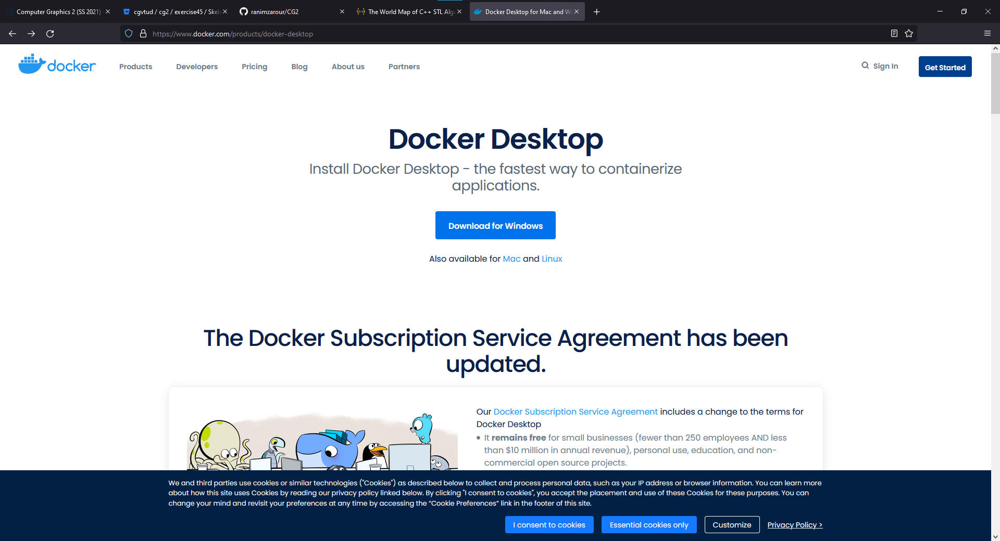
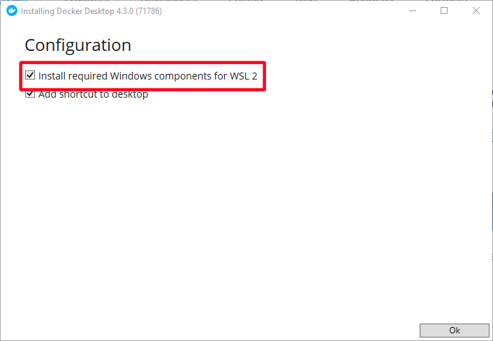
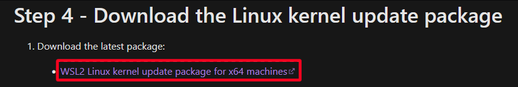
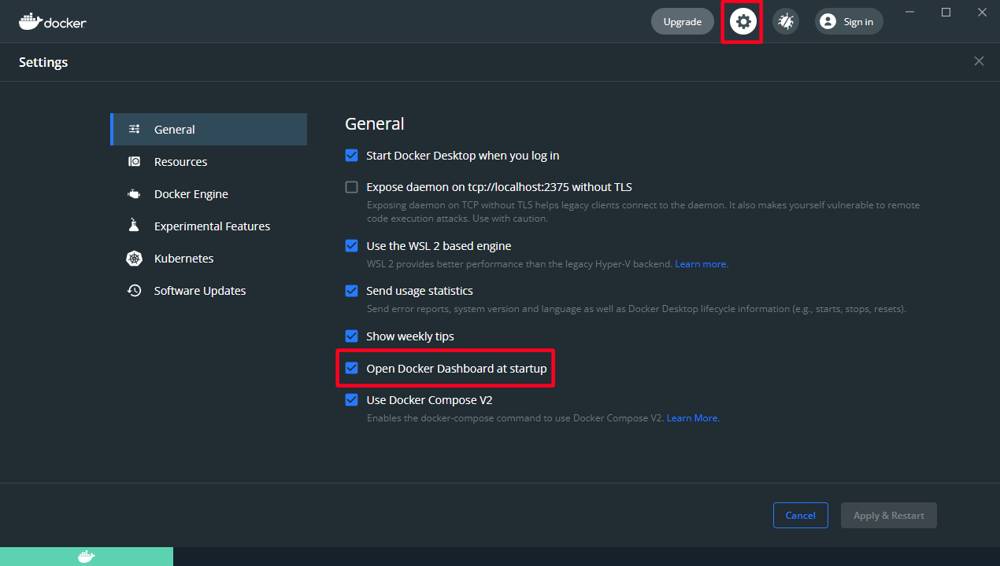
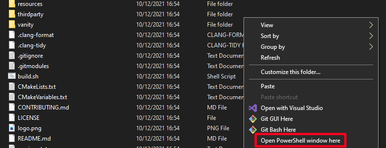
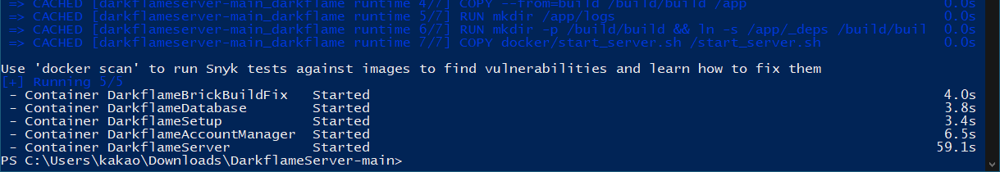
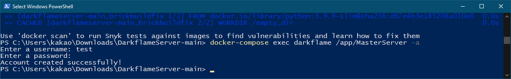
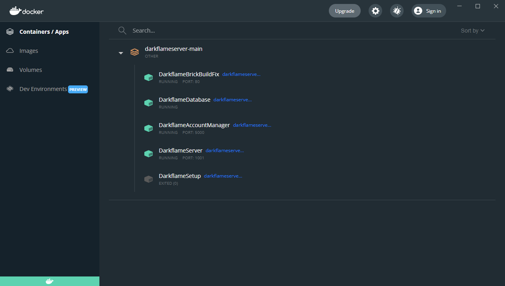
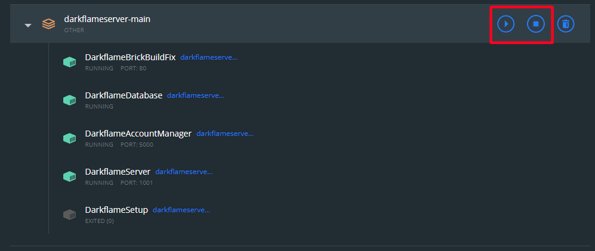

# Installation under Windows
## First Run
1. Navigate to the [Docker download page](https://www.docker.com/products/docker-desktop) and download docker.

    

2. Once the file has finished downloading, run it and proceed through the installation. Make sure, "Install required Windows components for WSL 2" is checked.

    

3. If necessary, restart your computer.
4. After the restart, Docker Desktop will automatically open. If it does not, simply start it like any other program.
5. If a window "WSL 2 Installation is incomplete." pops up, follow the link and click "WSL2 Linux kernel update package for x64 machines". Run the downloaded file and once that finishes, click "Restart" in the Docker Desktop window.

    

6. Wait until Docker Desktop has started. You may skip the tutorial.
7. You may want to disable "Open Docker Dashboard at startup" in _Settings_ -> _General_

    

8. Install [Git for Windows](https://git-scm.com/download/win). During the installation, simply confirming the defaults is sufficient.
9. In the folder you wish to save the Server, right click and select "Git Bash Here".
10. Type `git clone --recursive https://github.com/DarkflameUniverse/DarkflameServer`
11. Once the command has completed (you can see you path again and can enter commands), close the window.
12. Inside the downloaded folder, copy `.env.example` and name the copy `.env`
13. Open `.env` with Notepad by right-clicking it and selecting _Open With_ -> _More apps_ -> _Notepad_.
14. Change the text after `CLIENT_PATH=` to the location of your client. The folder you are pointing to must contain a folder called `client` which should contain the client files.
    > If you need the extra performance, place the client files in `\\wsl$\<your linux OS>\...` to avoid working across file systems, see [Docker Best Practices](https://docs.docker.com/desktop/windows/wsl/#best-practices) and [WSL documentation](https://docs.microsoft.com/en-us/windows/wsl/filesystems#file-storage-and-performance-across-file-systems).

15. Optionally, you can change the number after `BUILD_THREADS=` to the number of cores / threads your processor has. If your computer crashes while building, you can try to reduce this value.
16. After `ACCOUNT_MANAGER_SECRET=` paste a "SHA 256-bit Key" from https://keygen.io/
17. If you are not only hosting a local server, change the value after `EXTERNAL_IP=` to the external IP address of your computer.
18. Change the two values `SECRET_VALUE_CHANGE_ME` to passwords only you know. Save and close the file.
19. In the extracted folder hit Shift+Right Click and select "Open PowerShell window here".

    

17. In the new window, paste (with right click) or type `docker compose up -d --build` and confirm with enter.
18. Once you see the blinking cursor and the path again, setup has finished and the server is already running.

    

19. Create an admin account by pasting `docker compose exec darkflame /app/MasterServer -a` and following the prompts.

    

20. You can now login with these credentials at `http://your_ip:5000` (replace your_ip with your external IP). There you can create your account for playing as well as generate keys for other people to join; use these at `http://your_ip:5000/activate`

## Normal Use
1. In Docker Desktop you should now see an entry `darkflameserver-main` and when you click on it all containers but `DarkflameSetup` should eventually be green. That means the server is running.

    

2. For troubleshooting, you can check the logs of the various parts by clicking their entry.
3. You can start and stop the server with the corresponding buttons. Once all containers are grey, the server has shut down, and when all containers but `DarkflameSetup` are green, the server is running. Note that starting and stopping takes some time, please be patient.

    
