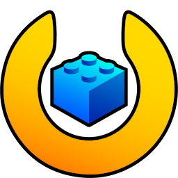

#  Darkflame Universe

## Introduction
Darkflame Universe (DLU) is a server emulator for LEGO® Universe. Development started in 2013 and has gone through multiple iterations and is now able to present a near perfect emulation of the game server.

### LEGO® Universe
Developed by NetDevil and The LEGO Group, LEGO® Universe launched in October 2010 and ceased operation in January 2012.

## This branch (`dev/aronwk-aaron/experimental`)
An experimental branch of DLU, kept rebased on `main`. Besides everything in `main` it adds the following. Every
feature that changes gameplay or live data is off by default or matches live behaviour unless noted, and each has its
own documentation in [docs/](docs/).

### AI usage
Much of this branch was written with an AI coding assistant (Anthropic's Claude), working under the maintainer's
direction. Commits it helped write carry a `Co-Authored-By: Claude` line. The maintainer reviews that code before it is
proposed for `main`, and it goes through the project's normal review like any other contribution; nothing from this
branch reaches `main` without that. Findings about the game client come from the client itself in Ghidra, checked
against packet captures where possible, not from the assistant's memory.

The server uses AI in exactly one place: the dashboard's optional moderator helper, which drafts a suggested action
for staff on a player report, chat messages, a pending name or an economy flag. It is only a draft; staff decide and act
(off by default, needs an API key; see "AI moderator helper" in [docs/Dashboard.md](docs/Dashboard.md)). Nothing
players see or talk to in the game is generated by AI.

### Web dashboard (`DashboardServer`)
A web dashboard for running and moderating a server, started and supervised by master like the other servers. See
[docs/Dashboard.md](docs/Dashboard.md).
* **Accounts and sign-in:** staff and player accounts, permissions per rank, two-factor login,
  password resets and registration by email (SMTP or OAuth2), locking after failed sign-ins, scoped API keys with rate
  limits and quotas ([API](docs/DasshboardWebAPI.yaml)).
* **Running the server:** server and world lists with live state (starting, ready, stopping), prestarted worlds as a
  setting, announcements, scheduled and cancellable restarts, live updates, scheduled announcements, events, community
  challenges and tasks, backups, webhooks and alerts, server health and instance load, per-server traffic diagnostics,
  system logs with downloadable log bundles, crash dumps.
* **Settings:** every setting the servers read, grouped by purpose with typed inputs, conditions, fuzzy search,
  history, and hot reload; values can be set on the page or kept in the `.ini` files.
* **Players and characters:** online players, character editing with history and lost-item recovery, inventory with
  item search, missions and progress, a 3D world view with player positions and position history, related accounts.
* **Moderation:** review queue, warnings, bans and strikes, player reports, linked accounts, chat filter, chat log and
  chat bridges, an AI helper for staff (never for players), pet name moderation, leaderboards.
* **Properties:** property pages with models, rent, reputation, moderation, import/remove/reprocess of models, a 3D
  property view that plays model behaviours, and a public property showcase.
* **Economy:** economy reports, contraband list with flagging and optional removal, saved views and report emails.
* **Public pages:** an optional public server status page and widget, and pages for players.
* **Developer tools:** a game message inspector, a CDClient table browser, 3D views of zones and properties drawn from
  the client's own files (scenes streamed like the game, zone lighting, hidden objects toggle).

### UGC server (`UgcServer`)
Makes and serves player-built (Brick-by-Brick) models the way LU Toolbox does, so every player sees them and their
icons without building them locally. See [docs/UgcServer.md](docs/UgcServer.md).
* Builds each model's meshes from the client's brick primitives with LU Toolbox's palette, color variation, hidden
  face removal and baked ambient occlusion, at two levels of detail, and draws its icon (DXT5 DDS like the client's).
* Optional looks with the client's own shaders: metal, brushed steel, glow, glitter (animated flecks) and satin.
* Serves models and icons to clients with or without the client's 3D services (the manifest the client asks worlds
  for, sd0 downloads); served models keep collision, built by each client from the model's LXFML.
* Car and rocket icons made once per combination of modules; a queue in the database with a quiet period after saves,
  staff reprocessing at the front, CPU and memory budgets, crash dumps, storage caps and purging.
* Dashboard pages: a UGC gallery and viewer, sortable lists with processing time, CPU, memory and triangles saved, a
  3D icon pose editor, per-model and per-kind icon settings.
* `/reprocessproperty` makes a property's models again and reloads the property for everyone on it.

### Live updates and moving players
* **Live updates:** move every server onto a new build without a restart. Worlds are replaced one by one and their
  players moved with the game's own "Mythran dimensional shift"; auth, chat, UGC and the dashboard restart or hand
  over. See [docs/LiveUpdate.md](docs/LiveUpdate.md).
* **Instance replace and merge:** move an instance's players to another instance of the same zone (GM commands and
  master coordination). See [docs/SeamlessTransfer.md](docs/SeamlessTransfer.md).
* Master's failed server starts no longer leave a second master running.

### Gameplay and world
* **Properties:** optional rent; reputation from visitors that resists farming; best friends of the owner can build
  while the owner has build mode on (off by default); models remember who placed them; optionally log back in on a
  property.
* **Brick-by-Brick:** server-side autosave storage, model metadata answers, and saved builds split into models with
  every bone and rigid system moved together. See [docs/BuildWorkflow.md](docs/BuildWorkflow.md).
* **Scene ghosting** (optional): players get the objects of the scenes the client has loaded, as the client streams
  them.
* Server-side knockback for AI-moved objects, switchable trigger volumes, missing force field, jetpack NPC and
  Skullkin volume scripts, deletion restrictions enforced, cross-world new-mail notices, pet LOTs stored with names,
  stale character saves refused.

### Networking and data
* **Packets:** packets and game messages moved to structs with Serialize/Deserialize, each conversion verified byte for
  byte against the old code; message IDs pinned by tests (a few hand-written senders remain to convert). See [docs/PacketArchitecture.md](docs/PacketArchitecture.md).
* **Traffic:** every server counts its packets and HTTP requests and reports them for the dashboard.
* **Databases:** MySQL/MariaDB and SQLite kept in step by parity tests; new tables for the dashboard, UGC, API keys,
  traffic and more; settings kept in the database for the dashboard, with the `.ini` files listing every setting.
* `bind_ip` for the server sockets; login steps timed from auth through master to the world.

## License
Darkflame Universe is licensed under AGPLv3, please read [LICENSE](LICENSE). Some important points:
* We are not liable for anything you do with the code
* The code comes without any warranty what so ever
* You must disclose any changes you make to the code when you distribute it
* Hosting a server for others counts as distribution

### Hosting a server
We do not recommend hosting public servers. Darkflame Universe is intended for small scale deployment, for example within a group of friends. It has not been tested for large scale deployment which comes with additional security risks.

### Supply of resource files
Darkflame Universe is a server emulator and does not distribute any LEGO® Universe files. A separate game client is required to setup this server emulator and play the game, which we cannot supply. Users are strongly suggested to refer to the safe checksums listed [here](#verifying-your-client-files) to see if a client will work.

## Setting up a single player server
* If you don't know what WSL is, skip this warning.
	Warning: WSL version 1 does NOT support using sqlite as a database due to how it handles filesystem synchronization.
	You must use Version 2 if you must run the server under WSL. Not doing so will result in save data loss.
* Single player installs now no longer require building the server from source or installing development tools.
* Download the [latest windows release](https://github.com/DarkflameUniverse/DarkflameServer/releases) (or whichever release you need) and extract the files into a folder inside your client. Note that this setup is expecting that when double clicking the folder that you put in the same folder as `legouniverse.exe`, the file `MasterServer.exe` is in there.
* You should be able to see the folder with the server files in the same folder as `legouniverse.exe`.
* Go into the server files folder and open `sharedconfig.ini`. Find the line that says `client_location` and put `..` after it so the line reads `client_location=..`.
* To run the server, double-click `MasterServer.exe`.
* You will be asked to create an account the first time you run the server. After you have created the account, the server will shutdown and need to be restarted.
* To connect to the server, either delete the file `boot.cfg` which is found in your LEGO Universe client, rename the file `boot.cfg` to something else or follow the steps [here](#allowing-a-user-to-connect-to-your-server) if you wish to keep the file.
* When shutting down the server, it is highly recommended to click the `MasterServer.exe` window and hold `ctrl` while pressing `c` to stop the server.
* We are working on a way to make it so when you close the game, the server stops automatically alongside when you open the game, the server starts automatically.
* If you are not setting a server up on mac, you can ignore this note
* Note: you'll need to allow through System Preferences `AuthServer`, `ChatServer`, `MasterServer`, `WorldServer` and `libmariadbcpp.dylib` to run.  The initial pop-up will block it due to the binaries being unsigned, after allowing them to run the servers will run as normal.

<font size="32">**If you are not planning on hosting a server for others, working in the codebase or wanting to use MariaDB for a database, you can stop reading here.**</font>

If you would like to use a MariaDB as a database instead of the default of sqlite, follow the steps [here](#database-setup).

# Steps to setup a development environment
* [Clone this repository](#clone-the-repository)
* [Setting up a development environment](#setting-up-a-development-environment)
* [Install dependencies](#install-dependencies)
* [Database setup](#database-setup)
* [Build the server](#build-the-server)
* [Configuring your server](#configuring-your-server)
	* [Required Configuration](#required-configuration)
	* [Optional Configuration](#optional-configuration)
* [Verify your setup](#verify-your-setup)
* [Running the server](#running-the-server)
* [User Guide](#user-guide)
* [Docker](#docker)

## Disclaimers
### Setup difficulty
Throughout the entire build and setup process a level of familiarity with the command line and preferably a Unix-like development environment is greatly advantageous.

## Step by step walkthrough for building a single-player Windows server from source
If you would like a setup for a single player server only on a Windows machine built from source, use the [Native Windows Setup Guide by HailStorm](https://gist.github.com/HailStorm32/169df65a47a104199b5cc57d10fa57de) and skip this README.

## Clone the repository
If you are on Windows, you will need to download and install git from [here](https://git-scm.com/download/win)

Then run the following command
```bash
git clone --recursive https://github.com/DarkflameUniverse/DarkflameServer
```

## Install dependencies

### Required compiler versions
- g++11 or greater
- MSVC unchecked
- clang unchecked
- appleclang unchecked

### Windows packages
Ensure that you have either the [MSVC C++ compiler](https://visualstudio.microsoft.com/vs/features/cplusplus/) (recommended) or the [Clang compiler](https://github.com/llvm/llvm-project/releases/) installed.
You'll also need to download and install [CMake](https://cmake.org/download/) (<font size="4">**version 3.25**</font> up to <font size="4">**version 3.31**</font>!).

### MacOS packages
Ensure you have [brew](https://brew.sh) installed.
You will need to install the following packages
```bash
brew install cmake gcc mariadb openssl zlib
```

### Linux packages
Make sure packages like `gcc`, and `zlib` are installed. Depending on the distribution, these packages might already be installed. Note that on systems like Ubuntu, you will need the `zlib1g-dev` package so that the header files are available. `libssl-dev` will also be required as well as `openssl`. You will also need a MySQL database solution to use. We recommend using `mariadb-server`.

For Ubuntu, you would run the following commands. On other systems, the package install command will differ.

```bash
sudo apt update && sudo apt upgrade

# Install packages
sudo apt install build-essential gcc zlib1g-dev libssl-dev openssl mariadb-server cmake
```

#### Required CMake version
This project uses <font size="4">**CMake version 3.25**</font> up to <font size="4">**version 3.31**</font> and as such you will need to ensure you have this version installed.
You can check your CMake version by using the following command in a terminal.
```bash
cmake --version
```

If you are going to be using an Ubuntu environment to run the server, you may need to get a more recent version of `cmake` than the packages available may provide.

The general approach to do so would be to obtain a copy of the signing key and then add the CMake repository to your apt.
You can do so with the following commands.

[Source of the below commands](https://askubuntu.com/questions/355565/how-do-i-install-the-latest-version-of-cmake-from-the-command-line)

```bash
# Remove the old version of CMake
sudo apt purge --auto-remove cmake

# Prepare for installation
sudo apt update && sudo apt install -y software-properties-common lsb-release && sudo apt clean all

# Obtain a copy of the signing key
wget -O - https://apt.kitware.com/keys/kitware-archive-latest.asc 2>/dev/null | gpg --dearmor - | sudo tee /etc/apt/trusted.gpg.d/kitware.gpg >/dev/null

# Add the repository to your sources list.
sudo apt-add-repository "deb https://apt.kitware.com/ubuntu/ $(lsb_release -cs) main"

# Next you'll want to ensure that Kitware's keyring stays up to date
sudo apt update
sudo apt install kitware-archive-keyring
sudo rm /etc/apt/trusted.gpg.d/kitware.gpg

# If sudo apt update above returned an error, copy the public key at the end of the error message and run the following command
# if the error message was "The following signatures couldn't be verified because the public key is not available: NO_PUBKEY 6AF7F09730B3F0A4"
# then the below command would be "sudo apt-key adv --keyserver keyserver.ubuntu.com --recv-keys 6AF7F09730B3F0A4"
sudo apt-key adv --keyserver keyserver.ubuntu.com --recv-keys <TheCopiedPublicKey>

# Finally update and install
sudo apt update
sudo apt install cmake
```

## Database setup
First you'll need to start MariaDB.

For Windows the service is always running by default.

For MacOS, run the following command
```bash
brew services start mariadb
```

For Linux, run the following command
```bash
sudo systemctl start mysql
# If systemctl is not a known command on your distribution, try the following instead
sudo service mysql start
```

<font size="4">**You will need to run this command every time you restart your environment**</font>

If you are using Linux and `systemctl` and want the MariaDB instance to start on startup, run the following command
```bash
sudo systemctl enable --now mysql
```

Once MariaDB is started, you'll need to create a user and an empty database for Darkflame Universe to use.

First, login to the MariaDB instance.

To do this on Ubuntu/Linux, MacOS, or another Unix like operating system, run the following command in a terminal
```bash
# Logs you into the MariaDB instance as root
sudo mysql
```

For Windows, run the following command in the `Command Prompt (MariaDB xx.xx)` terminal
```bash
# Logs you into the mysql instance
mysql -u root -p
# You will then be prompted for the password you set for root during installation of MariaDB
```

Now that you are logged in, run the following commands.

```bash
# Creates a user for this computer which uses a password and grant said user all privileges.
# Change mydarkflameuser to a custom username and password to a custom password. 
CREATE USER 'mydarkflameuser'@'localhost' IDENTIFIED BY 'password';
GRANT ALL ON *.* TO 'mydarkflameuser'@'localhost' WITH GRANT OPTION;
FLUSH PRIVILEGES;

# Then create a database for Darkflame Universe to use.
CREATE DATABASE darkflame;
```

## Build the server
You can either run `build.sh` when in the root folder of the repository:

```bash
./build.sh
```

Or manually run the commands used in [build.sh](build.sh).

If you would like to build the server faster, append `-j<number>` where number is the number of simultaneous compile jobs to run at once.  It is recommended that you have this number always be 1 less than your core count to prevent slowdowns.  The command would look like this if you would build with 4 jobs at once:
```bash
./build.sh -j4
```
### Notes
Depending on your operating system, you may need to adjust some pre-processor defines in [CMakeVariables.txt](./CMakeVariables.txt) before building:
* If you are on MacOS, ensure OPENSSL_ROOT_DIR is pointing to the openssl root directory.
* By default it should be set to the correct directory.
* If you are using a Darkflame Universe client, ensure `client_net_version` in `build/sharedconfig.ini` is changed to 171023.

## Configuring your server
This server has a few steps that need to be taken to configure the server for your use case.

### Required Configuration
Darkflame Universe can run with either a packed or an unpacked client.
Navigate to `build/sharedconfig.ini` and fill in the following fields:
* `mysql_host` (This is the IP address or hostname of your MariaDB server.  This is highly likely `localhost`)
  * If you setup your MariaDB instance on a port other than 3306, which can be done on a Windows install, you will need to make this value `tcp://localhost:portNum` where portNum is replaced with the port you chose to run MariaDB on.
* `mysql_database` (This is the database you created for the server)
* `mysql_username` (This is the user you created for the server)
* `mysql_password` (This is the password for the user you created for the server)
* `client_location` (This is the location of the client files.  This should be the folder path of a packed or unpacked client)
	* Ideally the path to the client should not contain any spaces.

### Optional Configuration
* After the server has been built there should be five `ini` files in the build directory: `sharedconfig.ini`, `authconfig.ini`, `chatconfig.ini`, `masterconfig.ini`, and `worldconfig.ini`.
* `authconfig.ini` contains an option to enable or disable play keys on your server. Do not change the default port for auth.
* `chatconfig.ini` contains a port option.
* `masterconfig.ini` contains options related to permissions you want to run your servers with.
* `sharedconfig.ini` contains several options that are shared across all servers
	* `bind_ip` sets the local IPv4 address the servers listen on (empty, the default, listens on all interfaces). Players are still sent `external_ip`, so the two can differ behind NAT or a proxy.
* `worldconfig.ini` contains several options to turn on Quality of Life improvements should you want them. If you would like the most vanilla experience possible, you will need to turn some of these settings off.

## Verify your setup
Your build directory should contain at a minimum all of the following files.
All listed files are required for a server to start.
`ini` files can be located at the environment variable `DLU_CONFIG_DIR` and do not need to be located in this directory.
(windows will have .exe at the end of the executables):
* sharedconfig.ini
* AuthServer(.exe)
* authconfig.ini
* ChatServer(.exe)
* chatconfig.ini
* MasterServer(.exe)
* masterconfig.ini
* WorldServer(.exe)
* worldconfig.ini
* blocklist.dcf
* migrations
* vanity
* navmeshes
* 1 of the following lists based on platform
	* windows
		* libmariadb.dll
		* mariadbcpp.dll
		* zlib.dll
	* MacOS
		* libmariadbcpp.dylib
	* *nix
		* libmariadbcpp.so

## Running the server
If everything has been configured correctly you should now be able to run the `MasterServer` binary which is located in the `build` directory. Darkflame Universe utilizes port numbers under 1024, so under Linux you have to give the `AuthServer` binary network permissions by running the following command:
```bash
sudo setcap 'cap_net_bind_service=+ep' AuthServer
```

### Linux Service
If you are running this on a linux based system, it will use your terminal to run the program interactively, preventing you using it for other tasks and requiring it to be open to run the server.  
_Note: You could use screen or tmux instead for virtual terminals_  
To run the server non-interactively, we can use a systemctl service by copying the following file:  
```shell
cp ./systemd.example /etc/systemd/system/darkflame.service
```  

Make sure to edit the file in `/etc/systemd/system/darkflame.service` and change the:  
- `User` and `Group` to the user that runs the darkflame server.  
- `ExecPath` to the full file path of the server executable.  

To register, enable and start the service use the following commands:

- Reload the systemd manager configuration to make it aware of the new service file:
```shell
systemctl daemon-reload
```
- Start the service:
```shell
systemctl start darkflame.service
```
- Enable OR disable the service to start on boot using:
```shell
systemctl enable darkflame.service
systemctl disable darkflame.service
```
- Verify that the service is running without errors:
```shell
systemctl status darkflame.service
```
- You can also restart, stop, or check the logs of the service using journalctl
```shell
systemctl restart darkflame.service
systemctl stop darkflame.service
journalctl -xeu darkflame.service
```

### First user or adding more users.
The first time you run `MasterServer`, you will be prompted to create an account. To create more accounts from the command line, `MasterServer -a` to get prompted to create an admin account. This method is only intended for the system administrator as a means to get started, do NOT use this method to create accounts for other users!

### Web dashboard
**If you are just using this server for yourself, you can skip the dashboard**

The server includes a web dashboard for account management, moderation (names, pets, properties), economy reports and server settings. Turn it on with `enable_dashboard=1` in `masterconfig.ini`; see [docs/Dashboard.md](docs/Dashboard.md) for setup, backups and security. It replaces the separate [Nexus Dashboard](https://github.com/DarkflameUniverse/NexusDashboard), which still works if you prefer it.

### Admin levels
The admin level, or Game Master level (hereafter referred to as gmlevel), is specified in the `accounts.gm_level` column in the MySQL database. Normal players should have this set to `0`, which comes with no special privileges. The system administrator will have this set to `9`, which comes will all privileges. gmlevel `8` should be used to give a player a majority of privileges without the safety critical once.

While a character has a gmlevel of anything but `0`, some gameplay behavior will change. When testing gameplay, you should always use a character with a gmlevel of `0`.

# User guide
Some changes to the client `boot.cfg` file are needed to play on your server.

## Allowing a user to connect to your server
**ALL OF THESE CHANGES ARE REQUIRED. PLEASE FULLY READ THIS SECTION**

To connect to a server follow these steps:
* In the client directory, locate `boot.cfg`
* Open `boot.cfg` in a text editor and locate the line `UGCUSE3DSERVICES=7:`
* Ensure the number after the 7 is a `0`
* Alternatively, remove the line with `UGCUSE3DSERVICES` altogether
* Next locate where it says `AUTHSERVERIP=0:`
* Replace the contents after to `:` and the following `,` with what you configured as the server's public facing IP. For example `AUTHSERVERIP=0:localhost` for locally hosted servers
* Launch `legouniverse.exe`, through `wine` if on a Unix-like operating system
* Note that if you are on WSL2, you will need to configure the public IP in the server and client to be the IP of the WSL2 instance and not localhost, which can be found by running `ifconfig` in the terminal. Windows defaults to WSL1, so this will not apply to most users.
As an example, here is what the boot.cfg is required to contain for a server with the ip 12.34.56.78
```cfg
AUTHSERVERIP=0:12.34.56.78,
UGCUSE3DSERVICES=7:0
```

## Updating your server
To update your server to the latest version navigate to your cloned directory
```bash
cd path/to/DarkflameServer
```
Run the following commands to update to the latest changes
```bash
git pull
git submodule update --init --recursive
```
Now follow the [build](#build-the-server) section for your system and your server is up to date.

## In-game commands
* A list of all in-game commands can be found [here](./docs/Commands.md).

## Chat Web API
* The Chat server has an API that can be enabled via `chatconfig.ini`.
* You can view the OpenAPI doc for the API here [here](./docs/ChatWebAPI.yaml).

## Verifying your client files

### LEGO® Universe 1.10.64
To verify that you are indeed using a LEGO® Universe 1.10.64 client, make sure you have the full client compressed **in a rar file** and run the following command.
```bash
# Replace <file> with the file path to the zipped client

# If on Linux or MacOS
shasum -a 256 <file>

# If on Windows using the Command Prompt
certutil -hashfile <file> SHA256
```

Below are known good SHA256 checksums of the client:
* `8f6c7e84eca3bab93232132a88c4ae6f8367227d7eafeaa0ef9c40e86c14edf5` (packed client, rar compressed)
* `c1531bf9401426042e8bab2de04ba1b723042dc01d9907c2635033d417de9e05` (packed client, includes extra locales, rar compressed)
* `0d862f71eedcadc4494c4358261669721b40b2131101cbd6ef476c5a6ec6775b` (unpacked client, includes extra locales, rar compressed)

If the returned hash matches one of the lines above then you can continue with setting up the server. If you are using a fully downloaded and complete client from live, then it will work, but the hash above may not match. Otherwise you must obtain a full install of LEGO® Universe 1.10.64.
You must also make absolutely sure your LEGO Universe client is not in a Windows OneDrive. DLU is not and will not support a client being stored in a OneDrive, so ensure you have moved the client outside of that location.

### Darkflame Universe Client
Darkflame Universe clients identify themselves using a higher version number than the regular live clients out there.
This was done make sure that older and incomplete clients wouldn't produce false positive bug reports for us, and because we made bug fixes and new content for the client.

To verify that you are indeed using a Darkflame Universe client, make sure you have the full client compressed **in a zip file** and run the following command.

```bash
# Replace <file> with the file path to the zipped client

# If on Linux or MacOS
shasum -a 1 <file>

# If on Windows using the Command Prompt
certutil -hashfile <file> SHA1
```

Known good *SHA1* checksum of the Darkflame Universe client:
- `91498e09b83ce69f46baf9e521d48f23fe502985` (packed client, zip compressed)


# Docker

The Darkflame Server is automatically built and published as a Docker Container / [OCI](https://opencontainers.org/) Image to the GitHub Container Registry at:
[`ghcr.io/darkflameuniverse/darkflameserver`](https://github.com/DarkflameUniverse/DarkflameServer/pkgs/container/darkflameserver).

## Compose

> [!WARNING]
> It seems that Docker Desktop on Windows with the WSL 2 backend has some issues with MariaDB (c.f. [mariadb-docker#331](https://github.com/MariaDB/mariadb-docker/issues/331)) triggered by NexusDashboard
> migrations, so this setup may not work for you. If that is the case, please tell us about your setup in [NexusDashboard#92](https://github.com/DarkflameUniverse/NexusDashboard/issues/92).

You can use the `docker-compose` tool to [setup a MariaDB database](#database-setup), run the Darkflame Server and manage it with [Nexus Dashboard](https://github.com/DarkflameUniverse/NexusDashboard) all
at once. For that:

- [Install Docker Desktop](https://docs.docker.com/get-docker/)
- Open the directory that contains your LU Client
  - If the `legouniverse.exe` is in a subfolder called `client`, you're good to go. There may also be a folder `versions`.
  - Otherwise, create a new `client` folder and move the exe and everything else (e.g. `res` and `locale`) in there. This is necessary to work around a bug in the client that will prevent that you to log back in after getting disconnected.
- Download the [docker-compose.yml](docker-compose.yml) file and place it next to `client`.
- Download the [.env.example](.env.example) file and place it next to `client` with the file name `.env`
  - You may get warnings that this name starts with a dot, acknowledge those, this is intentional. Depending on your operating system, you may need to activate showing hidden files (e.g. Ctrl-H in Gnome on Linux) and/or file extensions ("File name extensions" in the "View" tab on Windows).
  - Update the `ACCOUNT_MANAGER_SECRET` and `MARIADB_PASSWORD` with strong random passwords.
    - Use a password generator <https://gchq.github.io/CyberChef/#recipe=Pseudo-Random_Number_Generator(256,'Hex')>
    - Avoid `:` and `@` characters
    - Once the database user is created, changing the password will not update it, so the server will just fail to connect.
  - Set `EXTERNAL_IP` to your LAN IP or public IP if you want to host the game for friends & family
- Open a terminal in the folder with the `docker-compose.yml` and `client`
- Run `docker compose up -d`
  - This might require `sudo` on Linux, and a recent version of [docker compose](https://docs.docker.com/compose/install/)
- Run `docker exec -it dlu-darkflameserver-1 /app/MasterServer -a` and follow the instructions to create the initial admin account
- Open <http://localhost:8000> to access Nexus Dashboard with the admin account to create normal users
- Set `AUTHSERVERIP=0:localhost` in `client/boot.cfg`
  - Replace `localhost` with the value of `EXTERNAL_IP` if you changed that earlier.
  - Also make sure `UGCUSE3DSERVICES=7:` is set to `0`
- Launch `legouniverse.exe`

## Standalone

This assumes that you have a database deployed to your host or in another docker container.

A basic deployment of this contianer would look like:
```sh
# example docker contianer deployment
docker run -it \
    -v /path/to/configs/:/app/configs \
    -v /path/to/logs/:/app/logs \
    -v /path/to/dumps/:/app/dumps \
    -v /path/to/res:/app/res:ro \
    -v /path/to/resServer:/app/resServer \
    -e DUMP_FOLDER=/app/dumps \
    -p 1001:1001/udp \
    -p 2005:2005/udp \
    -p 3000-3300:3000-3300/udp \
ghcr.io/darkflameuniverse/darkflameserver:latest
```
You will need to replace the `/path/to/`'s to reflect the paths on your host.

Any config option in the `.ini`'s can be overridden with environmental variables: Ex: `log_to_console=1` from `shared_config.ini` would be overidden like  `-e LOG_TO_CONSOLE=0`

# Development Documentation
This is a Work in Progress, but below are some quick links to documentaion for systems and structs in the server
[Networked message structs](https://lcdruniverse.org/lu_packets/lu_packets/index.html)
[General system documentation](https://docs.lu-dev.net/en/latest/index.html)

# Credits

## DLU Team
* [DarwinAnim8or](https://github.com/DarwinAnim8or)
* [Wincent01](https://github.com/Wincent01)
* [Mick](https://github.com/MickVermeulen)
* [averysumner](https://github.com/codeshaunted)
* [Jon002](https://github.com/jaller200)
* [Jonny](https://github.com/cuzitsjonny)
* [Aaron K.](https://github.com/aronwk-aaron)

### Research and Tools
* [lcdr](https://github.com/lcdr)
* [Xiphoseer](https://github.com/Xiphoseer)

### Community Management
* [Neal](https://github.com/NealSpellman)

### Logo
* Cole Peterson (BlasterBuilder)

## Active Contributors
* [EmosewaMC](https://github.com/EmosewaMC)
* [Jettford](https://github.com/Jettford)

## Former Contributors
* TheMachine
* Matthew
* [Raine](https://github.com/uwainium)
* Bricknave

## Special Thanks
* humanoid24
* pwjones1969
* [Simon](https://github.com/SimonNitzsche)
* [ALL OF THE NETDEVIL AND LEGO TEAMS!](https://www.mobygames.com/game/macintosh/lego-universe/credits)

This codebase uses some amount of AI assistance. Some larger portions may be AI generated as well. Do not use AI tools against the repo however to work on issues. Auto generated PR's/issues may be discarded as spam if done in large amounts.
