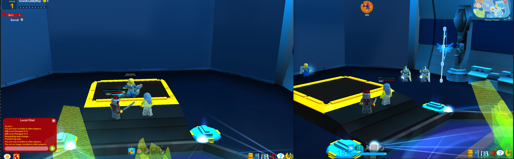
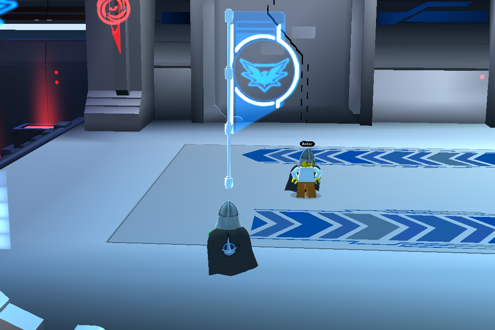

# Darkflame Cinema
A more emersive way to experience story in Darkflame Universe.

## What is Darkflame Cinema?
Darkflame Cinema is a way to create interactive — acted — experiences in Darkflame Universe. It aims to provide a complement to the ordinary mission structure with static NPCs and mission texts to convey story. Insperation is drawn from games likes of World of Warcraft, where NPCs frequently act out scenes, alone and in combination with both the player and other NPCs.

## Top-level design
Cinema works with a few concepts:
* **Actors** are the non player characters that act and perform actions.
* **Props** are objects in the world which complement the actors.
* **Scenes** are a collection of actors and props that perform an interactive play.
* **Plays** are scenes which are performed to a player.

## Play isolation
When a play is performed to a player, it is always isolated from the rest of the players in the world. This is to ensure that the player can experience the play without being disturbed by others, and others can't be disturbed by the play. This is achieved by ghosting all NPCs and props in the play to all players except the one experiencing the play.



## How to create a scene
A play is created is a couple of steps:
1. Acts out the scene in the world as how the NPCs should reenact it.
2. Create prefabs of props in the scene.
3. Put the NPCs and props in a scene file.
4. Edit the performed acts to add synchronization, conditions and additional actions.
5. Setting up the scene to be performed automatically.
6. Hiding zone objects while performing.

### 1. Acts out the scene
See <a href="./media/acting.mp4">media/acting.mp4</a> for an example of how to act out a scene. 

To start acting type: `/record-start (clear/copy)` in the chat. This will start recording your actions in the world. The actions recorded include:
* Movement
* Talking
* Equipping and unequipping items
* Explicit animations

By appending `clear` to the command, all gear on the NPC will be removed before reenactment. By appending `copy` to the command, all gear on the NPC will be copied from the player before reenactment. Which, if either, of these options to use depends on which NPC object will be acting. Usually you want to use `copy`. This can be edited manually later.

This acting is the core of the scene. Later we will learn how to add some interactivity to the scene.

When you are done acting, type `/record-stop` in the chat. This will stop recording your actions in the world.

Save your amazing performance by typing `/record-save <file.xml>` in the chat. **Do not forget to do this before starting your next recording!** This will save your performance to a file relative to where the server is running.

If your scene has multiple NPCs acting, now is the time to switch to the next NPC and repeat the steps above.

#### 1.1. Previewing your performances
See <a href="./media/preview.mp4">media/preview.mp4</a> for an example of how to preview a performance.

To show a preview of the performance you can type `/record-act (lot) (name)`, this will play the performance. If a lot is specified, the actor will be of that object. If a name is specified, the actor will have that name. If neither is specified, the actor will be a predetermined NPC.

You may load a performance by typing `/record-load <file.xml>` in the chat. This will load a performance from a file relative to where the server is running. You may than type `/record-act` to show a preview of the performance.

### 2. Create prefabs of props in the scene
Prefabs are a collection of objects that can be instantiated together. This is currently done exclusively by writing xml files.

Here is an example of a prefab:
```xml
<Prefab>
    <!--
        Lot is the id of the object to spawn.

        Position is defined in either coordinates (x,y,z).
        These are relative to the position of the prefab. 

        Rotation is defined in either euler angles (rx,ry,rz);
        or in a quaternion (qx,qy,qz,qw).

        Use /pos and /rot in the chat to get your current position and rotation.
    -->
    <Object lot="359" x="0" y="0" z="0" rx="0" ry="0" rz="0"/>
    <Object lot="53" x="0" y="5" z="0" rx="0" rz="0">
        <Effect id="60073"/> <!-- Custom effect -->
    </Object>
    <Object lot="359" x="0" y="5" z="0" rx="0" ry="0" rz="0"/>
    <Object lot="359" x="0" y="10" z="0" rx="0" ry="0" rz="0"/>
    <Object lot="53" x="0" y="0" z="0" rx="0" rz="0"/>
    <Object lot="53" x="0" y="10" z="0" rx="0" rz="0"/>
    <Object lot="53" x="0" y="15" z="0" rx="0" rz="0"/>
</Prefab>
```

This creates the following prefab:



You can spawn a prefab by typing `/prefab-spawn <file.xml>`. This will spawn the prefab at your current position.

### 3. Put the NPCs and props in a scene file
A scene file is a collection of actors and props that perform an interactive play. This is currently done exclusively by writing xml files.

Here is an example of a scene:
```xml
<!--
    The scene is defined by a collection of actors and props.
    These are defined by their name and prefab file.
-->
<Scene>
    <!--
        Props are defined by their file name and a position.

        See media/SFlagSmall.xml for this file.
    -->
    <Prefab file="vanity/prefabs/SFlagSmall.xml" x="-655.564" y="1123.76" z="75.993"/>

    <!--
        Actors are defined by their name and the file which holds the performance.

        See media/my-act.xml and media/my-act-2.xml for these files.
    -->
    <NPC name="John" act="vanity/acts/my-act.xml"/>
    <NPC name="Bill" act="vanity/acts/my-act-2.xml"/>
</Scene>
```

See <a href="./media/scene.mp4">media/scene.mp4</a> for how the above scene looks in the world.

You preview a scene by typing `/scene-act <file.xml>` in the chat. This will act out the scene for you.

### 4. Edit the performed acts
When you preview a newly created scene the NPCs will act out exactly what you did when you recorded the performance. This is not always what you want. You may want to add some interactivity to the scene. This is done by editing the performed acts.

An act is made out of a collection of records which will be evaluated in order. A record either performs some visual action or provides for flow control.

Here is an example of a slightly modified act which adds some interactivity:
```xml
<!--
    See media/my-act-mod.xml for this file.
-->
<Recorder>
    <!-- The following three records were added automaticly because I appended 'copy' to the command when I acted, but these may be modified freely here. -->
    <ClearEquippedRecord t="0"/>
    <EquipRecord item="9856" t="0"/>
    <EquipRecord item="6500" t="0"/>
    <MovementRecord x="-557.53174" y="1128.7369" z="50.89016" qx="0" qy="0.72913098" qz="0" qw="0.68437415" vx="0" vy="0" vz="0" avx="0" avy="0" avz="0" g="true" dv="false" dav="false" t="0.39199999"/>
    
    ...
    
    <!--
        The following records will assure that before the act continues, the player is within 10 units of the NPC.
        
        If the player is not within 10 units of them within 5 seconds, the NPC will ask the player to come closer. The NPC will continue to ask the player to come closer every 5 seconds until the player is within 10 units of them.
     -->
    
    <!-- 
        This is flow-control, the act will jump to the record with the name "check-player". This makes sure that if the player is already close enough, the NPC does not tell them to come closer. 
    -->
    <JumpRecord label="check-player" t="0" /> 

    <!-- 
        This is a manually added speak record, which will have the NPC speak, telling the player to come closer.
    -->
    <SpeakRecord name="join-me" text="Join me!" t="3.0" /> 

    <!-- 
        This is a player proximity record, it can branch two different ways. If the player comes within 10 units of the NPC within 5 seconds, the act will continue to the record. If however, the player is not within 10 units within 5 seconds, the act will jump to the record named "join-me", the record above this one. 
    -->
    <PlayerProximityRecord name="check-player" distance="10" timeout="5" timeoutLabel="join-me" t="0" /> 
    
    <SpeakRecord text="Welcome!" t="4.026"/>
    
    <MovementRecord x="-557.53174" y="1128.7369" z="50.89016" qx="0" qy="0.72913098" qz="0" qw="0.68437415" vx="0" vy="0" vz="0" avx="0" avy="0" avz="0" g="true" dv="false" dav="false" t="2.046"/>

    ...

    <SpeakRecord text="Great!&quot;" t="2.3759999"/>
    <MovementRecord x="-654.93365" y="1123.7504" z="67.158447" qx="0" qy="0.85166776" qz="0" qw="0.52408218" vx="0" vy="0" vz="0" avx="0" avy="0" avz="0" g="true" dv="false" dav="false" t="3.6960001"/>
</Recorder>
```

See <a href="./media/interactive.mp4">media/interactive.mp4</a> for how the above scene looks in the world.

The list of available records is extensive.

#### 4.1. Records
Each record specifies a time `t`. This is how long after this record is evaluated that the next record will be evaluated.

A record may also specify a `name`. This is used for flow control. If a record specifies a name, it may be jumped to by for example `JumpRecord` or `ForkRecord`.

#### 4.1. MovementRecord
This record sets the properties of the actors controllable physics component. This is the only record which isn't meant to be edited manually.

#### 4.2. SpeakRecord
This record makes the actor speak.
```xml
<SpeakRecord text="Hello!" t="3.0" />
```

#### 4.3. EquipRecord
This record makes the actor equip an item.
```xml
<EquipRecord item="9856" t="0"/>
```

#### 4.4. UnequipRecord
This record makes the actor unequip an item.
```xml
<UnequipRecord item="9856" t="0"/>
```

#### 4.5. ClearEquippedRecord
This record makes the actor unequip all items.
```xml
<ClearEquippedRecord t="0"/>
```

#### 4.6. AnimationRecord
This record makes the actor play an animation.
```xml
<AnimationRecord animation="salute" t="2.0"/>
```

#### 4.7. WaitRecord
This record makes the actor wait for a specified amount of time.
```xml
<WaitRecord t="5.5"/>
```

#### 4.8. JumpRecord
This record makes the act jump to a record with a specified name.
```xml
<JumpRecord label="check-player" t="0" />
```

#### 4.9. ForkRecord
This record makes a decision based on a condition, and jumps accordingly. The condition may either be a scene variable or a precondtion.
```xml
<!-- Jump to 'jump-true' if my-variable=1, else jump to 'jump-false'. -->
<ForkRecord variable="my-variable" value="1" success="jump-true" failure="jump-false" t="0" />

<!-- Jump to 'jump-true' if the given precondition holds for the player, else jump to 'jump-false'. -->
<ForkRecord precondition="42,99" success="jump-true" failure="jump-false" t="0" />
```

#### 4.10. PlayerProximityRecord
This record checks if the player is within a specified distance of the actor. If the player is within the distance, the act will continue to the next record. If the player is not within the distance, the act will jump to a record with a specified name.
```xml
<!-- Specifying the timeout is optional. If it is not specified, the act will wait forever for the player to come within the distance. -->
<PlayerProximityRecord name="check-player" distance="10" timeout="5" timeoutLabel="join-me" t="0" />
```

#### 4.11. SetVariableRecord
This record sets a scene variable to a specified value. These are shared between all actors in the scene.
```xml
<SetVariableRecord variable="my-variable" value="1" t="0" />
```

#### 4.12. BarrierRecord
This record makes the act wait until it gets a signal to continue from another act, or until an optional timeout is reached. This is useful for synchronizing multiple actors, for example in a conversation.
```xml
<!-- Specifying the timeout is optional. If it is not specified, the act will wait forever for the signal. -->
<BarrierRecord signal="my-signal" timeout="5" timeoutLabel="do-something-else" t="0" />
```

#### 4.13. SignalRecord
This record sends a signal to all acts waiting for it.
```xml
<SignalRecord signal="my-signal" t="0" />
```

#### 4.14. ConcludeRecord
This record concludes the play.
```xml
<ConcludeRecord t="0" />
```

#### 4.15. VisiblityRecord
This record makes the actor visible or invisible.
```xml
<VisiblityRecord visible="false" t="0" />
```

#### 4.16. PlayEffectRecord
This record plays an effect.
```xml
<PlayEffectRecord effect="5307" t="0" />
```

### 5. Setting up the scene to be performed automatically
Scenes can be appended with metadata to describe when they should be performed and what consequences they have. This is done by editing the scene file.

#### 5.1. Scene metadata
There attributes can be added to the `Scene` tag:

| Attribute | Description |
| --- | --- |
| `x y z` | The center of where the following two attributes <br> are measured. |
| `showingDistance` | The distance at which the scene will <br> be loaded for a player.<br><br> If the player exits this area the scene is unloaded. <br> If the scene has been registered as having been<br>viewed by the player, is is concluded. |
| `performingDistance` | The scene is registred as having been <br>viewed by the player. This doesn't mean <br>it can't be viewed again.<br><br>A signal named `"audiance"` will be <br> sent when the player enters this area. <br>This can be used to trigger the main <br>part of the scene. |
| `acceptMission` | The mission with the given id will be <br> accepted when the scene is concluded. |
| `completeMission` | The mission with the given id will be <br> completed when the scene is concluded. |

Here is an example of a scene with metadata:
```xml
<Scene x="-368.272" y="1161.89" z="-5.25745" performingDistance="50" showingDistance="200">
    ...
</Scene>
```

#### 5.2. Automatic scene setup
In either the worldconfig.ini or sharedconfig.ini file, add the following:
```
# Path to where scenes are located.
scenes_directory=vanity/scenes/
```

Now move the scene into a subdirectory of the scenes directory. The name of the subdirectory should be **the zone id** of the zone the scene is located in.

For example:
```
build/
├── vanity/
│   ├── scenes/
│   │   ├── 1900/
│   │   │   ├── my-scene.xml
```

Now the scene will be setup automatically and loaded when the player enters the `showingDistance` of the scene.

#### 5.3. Adding conditions
Conditions can be added to the scene to make it only performable when the player fulfills specified preconditions. This is done by editing the scene file.

Here is an example of a scene with conditions:
```xml
<Scene x="-368.272" y="1161.89" z="-5.25745" performingDistance="50" showingDistance="200">
    <Precondition expression="42,99"/> <!-- The player must fulfill preconditions 42 and 99. -->
    <Precondition expression="666" not="1"/> <!-- The player cannot fulfill precondition 666. -->
    ...
</Scene>
```

### 6. Hiding zone objects while performing
When a scene should be performed, you might want to hide some objects in the zone. This is done by adding server preconditions. This is a seperate file.

In either the worldconfig.ini or sharedconfig.ini file, add the following:
```
# Path to where server preconditions are located.
server_preconditions_directory=vanity/server-preconditions.xml
```

Now create the server preconditions file in the directory specified.

Here is an example of a server preconditions file:
```xml
<Preconditions>
    <Entity lot="12261">
        <Precondition not="1">1006</Precondition>
    </Entity>
</Preconditions>
```

This will hide the objects with lot 12261 for players who fulfill precondition 1006.
