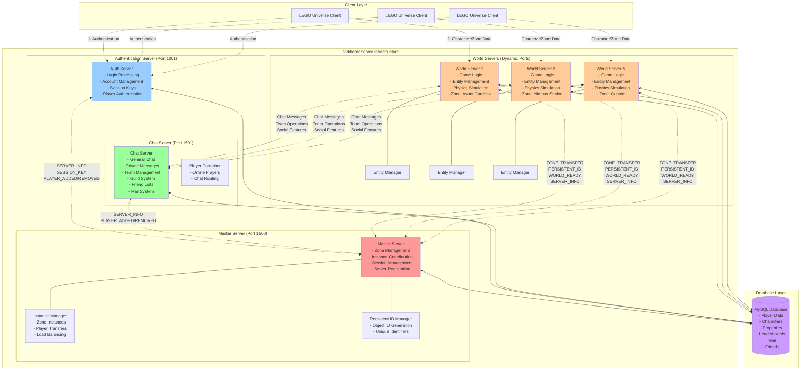
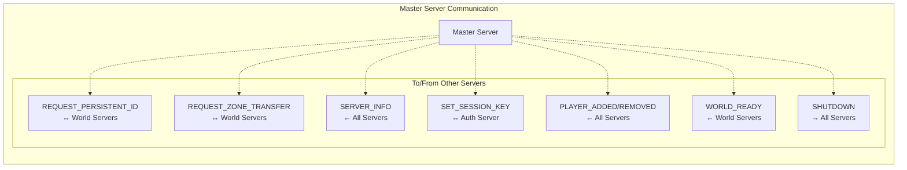
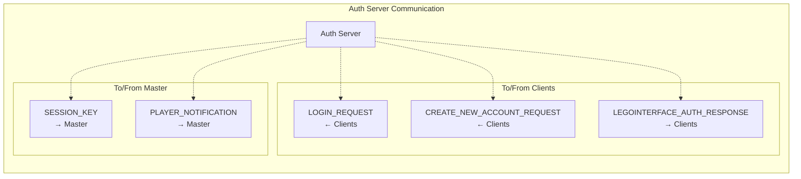
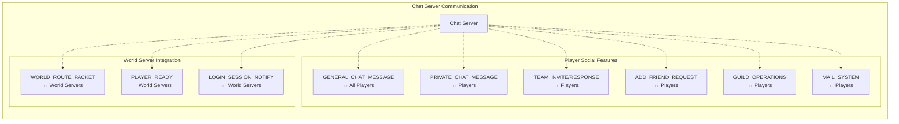
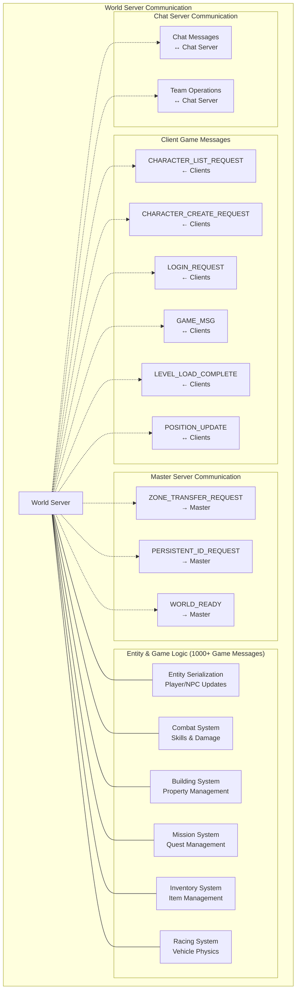
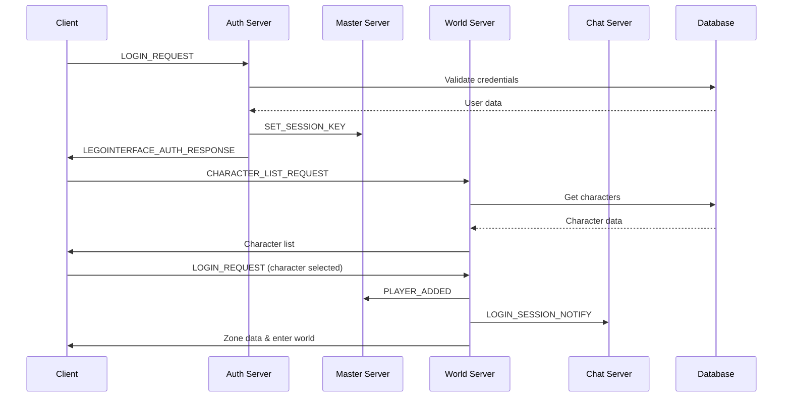
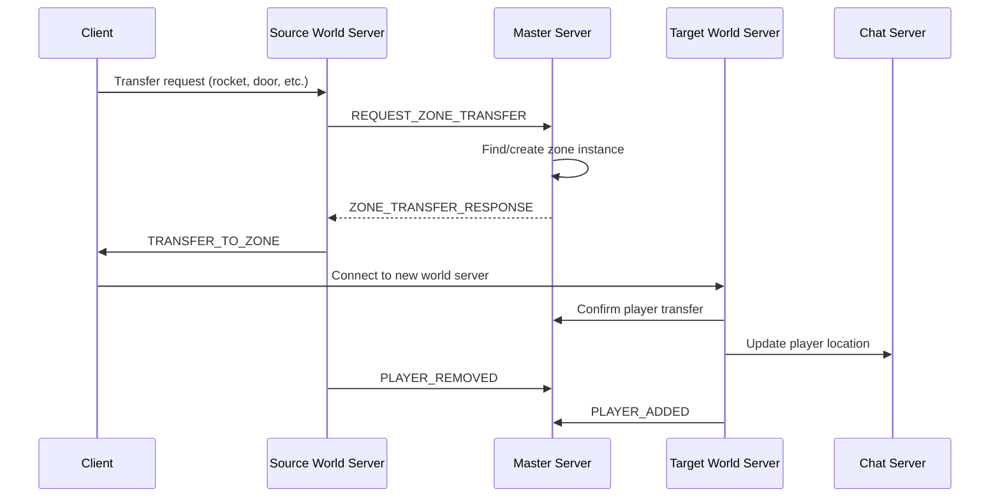
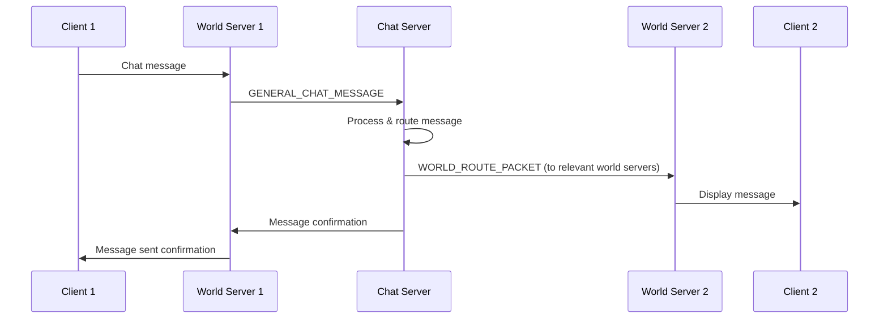

# DarkflameServer Architecture and Communication Diagram

This document provides a comprehensive overview of the server architecture, inter-server communication patterns, and message flows in the DarkflameServer LEGO Universe emulator.

## Server Architecture Overview



## Message Type Breakdown

### Master Server Messages (`MessageType::Master`)



### Authentication Server Messages (`MessageType::Auth`)



### Chat Server Messages (`MessageType::Chat`)



### World Server Messages (`MessageType::World` & `MessageType::Game`)



## Communication Flow Diagrams

### Player Login Flow



### Zone Transfer Flow



### Chat Message Flow



## Technical Implementation Details

### Network Architecture
- **Protocol**: RakNet UDP-based networking
- **Security**: Encryption enabled for external connections
- **Port Configuration**:
  - Master Server: 1500 (default)
  - Auth Server: 1001 (hardcoded in client)
  - Chat Server: 1501 (configurable)
  - World Servers: Dynamic ports assigned by Master

### Server-to-Server Communication
```cpp
// All servers maintain connection to Master
class dServer {
    Packet* ReceiveFromMaster();
    void SendToMaster(RakNet::BitStream& bitStream);
    bool ConnectToMaster();
    void SetupForMasterConnection();
};
```

### Key Classes and Components

#### Master Server Components
- `InstanceManager`: Manages zone instances and player distribution
- `PersistentIDManager`: Generates unique object IDs across all servers
- `MasterPackets`: Handles inter-server message protocols

#### World Server Components
- `EntityManager`: Manages all game entities and their serialization
- `UserManager`: Tracks connected players and their sessions
- `ReplicaManager`: Handles object replication to clients
- `GameMessages`: Processes 1000+ different game mechanic messages

#### Chat Server Components
- `PlayerContainer`: Maintains online player registry
- `TeamContainer`: Manages team/group functionality
- `ChatPacketHandler`: Routes all chat and social messages

### Database Integration
- All servers connect to shared MySQL database
- Player data, characters, mail, friends, properties stored centrally
- Concurrent access managed through connection pooling
- Migration system for database schema updates

### Scalability Features
- Multiple World Server instances for different zones
- Load balancing through Master Server's Instance Manager
- Dynamic server spawning capability
- Horizontal scaling support for high player counts

## Message Protocol Specifications

### Packet Structure
```
[RakNet Header][Message Type][Service Type][Message Data]
```

### Service Types
- `MASTER (5)`: Master server coordination
- `AUTH (1)`: Authentication services  
- `CHAT (2)`: Chat and social features
- `WORLD (4)`: Game world simulation
- `CLIENT (4)`: Client-specific messages

### Critical Message Types by Frequency
1. **GAME_MSG** (~60% of traffic): Real-time game mechanics
2. **POSITION_UPDATE** (~20% of traffic): Player movement
3. **Chat Messages** (~10% of traffic): Social communication
4. **Entity Serialization** (~8% of traffic): World state sync
5. **Administrative** (~2% of traffic): Server coordination

This architecture enables the DarkflameServer to faithfully recreate the LEGO Universe MMO experience through a distributed, scalable server infrastructure that can handle thousands of concurrent players across multiple game zones.